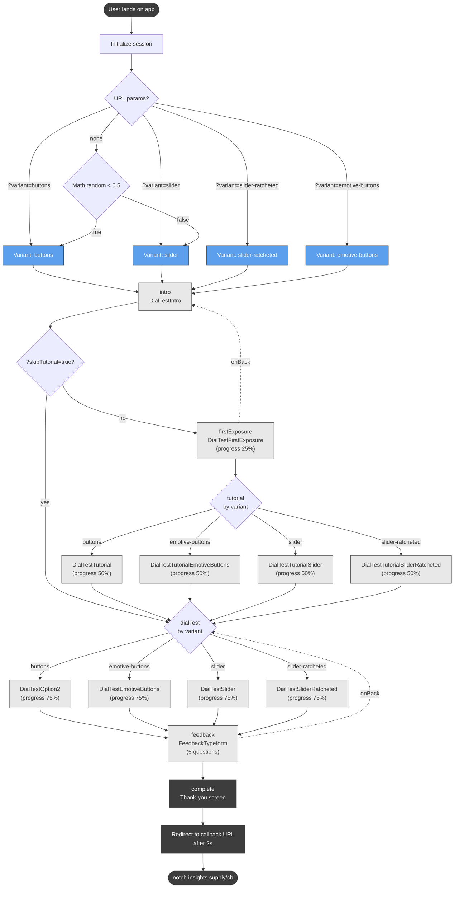
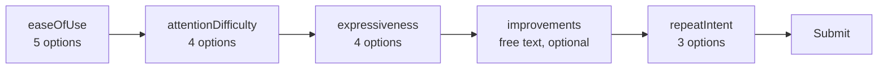

# Screen Flow Map

Complete map of screens and variants in the Dial Test app. Source of truth: `src/app/App.tsx`.

## High-level flow

## Steps and components

| `AppStep`       | Component(s)                                                                                                  | Progress | Notes                                  |
| --------------- | ------------------------------------------------------------------------------------------------------------- | -------- | -------------------------------------- |
| `intro`         | `DialTestIntro`                                                                                               | —        | Static welcome screen                  |
| `firstExposure` | `DialTestFirstExposure`                                                                                       | 25%      | First video viewing, no input required |
| `tutorial`      | `DialTestTutorial` / `DialTestTutorialEmotiveButtons` / `DialTestTutorialSlider` / `DialTestTutorialSliderRatcheted` | 50%      | Variant-specific practice              |
| `dialTest`      | `DialTestOption2` / `DialTestEmotiveButtons` / `DialTestSlider` / `DialTestSliderRatcheted`                   | 75%      | Variant-specific recorded test         |
| `feedback`      | `FeedbackTypeform`                                                                                            | ~100%    | 5 questions (single-select + text)     |
| `complete`      | inline thank-you screen                                                                                       | 100%     | Auto-redirects after 2s                |

## Variants

| `Variant`         | Tutorial                              | Dial Test                  |
| ----------------- | ------------------------------------- | -------------------------- |
| `buttons`         | `DialTestTutorial`                    | `DialTestOption2`          |
| `slider`          | `DialTestTutorialSlider`              | `DialTestSlider`           |
| `slider-ratcheted`| `DialTestTutorialSliderRatcheted`     | `DialTestSliderRatcheted`  |
| `emotive-buttons` | `DialTestTutorialEmotiveButtons`      | `DialTestEmotiveButtons`   |

## URL parameters

| Param          | Values                                                          | Effect                                          |
| -------------- | --------------------------------------------------------------- | ----------------------------------------------- |
| `variant`      | `buttons` \| `button` \| `slider` \| `slider-ratcheted` \| `emotive-buttons` | Override A/B assignment                         |
| `test`         | `true`                                                          | Test mode — nothing is saved to the database    |
| `skipTutorial` | `true`                                                          | Skip `firstExposure` + `tutorial`, jump to dial test |
| `RID`          | any                                                             | Forwarded to callback URL on completion         |

## Random assignment

When no `variant` URL param is provided, the app randomly assigns `buttons` or `slider` (50/50). `slider-ratcheted` and `emotive-buttons` are only reachable via the URL override.

## Feedback questionnaire (`FeedbackTypeform`)

Question wording for `easeOfUse` and `attentionDifficulty` adapts to whether the variant is slider-based or button-based.
