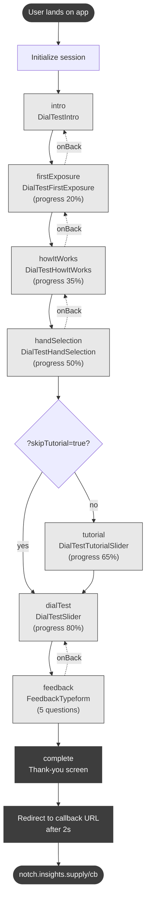
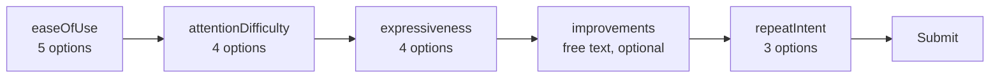

# Screen Flow Map

Map of screens in the Dial Test app. Source of truth: `src/app/App.tsx`.

## High-level flow

## Steps and components

| `AppStep`       | Component                | Progress | Notes                                                         |
| --------------- | ------------------------ | -------- | ------------------------------------------------------------- |
| `intro`         | `DialTestIntro`          | —        | Static welcome screen                                         |
| `firstExposure` | `DialTestFirstExposure`  | 20%      | First video viewing, no input required                        |
| `howItWorks`    | `DialTestHowItWorks`     | 35%      | Static explainer of the slider mechanic                       |
| `handSelection` | `DialTestHandSelection`  | 50%      | Captures handedness; persisted to `localStorage['sliderSide']` |
| `tutorial`      | `DialTestTutorialSlider` | 65%      | Slider practice run                                           |
| `dialTest`      | `DialTestSlider`         | 80%      | Recorded slider test                                          |
| `feedback`      | `FeedbackTypeform`       | ~100%    | 5 questions (single-select + text)                            |
| `complete`      | inline thank-you screen  | 100%     | Auto-redirects after 2s                                       |

## URL parameters

| Param          | Values | Effect                                                                                   |
| -------------- | ------ | ---------------------------------------------------------------------------------------- |
| `test`         | `true` | Test mode — nothing is saved to the database                                              |
| `skipTutorial` | `true` | Skip the `tutorial` screen only; flow becomes `… → handSelection → dialTest` |
| `RID`          | any    | Forwarded to callback URL on completion                                                  |

The variant is fixed to `slider` and sent to the backend as such for shape compatibility (`VARIANT` constant in `App.tsx`).

## Feedback questionnaire (`FeedbackTypeform`)

