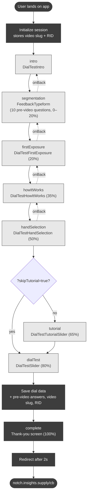

# Screen Flow Map

Map of screens in the Dial Test app. Source of truth: `src/app/App.tsx`.

This round (Visa/FIFA): 5 videos, each on its own `?video=` slug, fielded as
separate Lucid campaigns. Pre-video segmentation questions only — there are no
post-video questions. The session save + Lucid completion redirect fire at the
end of the dial.

## High-level flow

## Steps and components

| `AppStep`       | Component                | Progress | Notes                                                                 |
| --------------- | ------------------------ | -------- | --------------------------------------------------------------------- |
| `intro`         | `DialTestIntro`          | —        | Static welcome screen                                                 |
| `segmentation`  | `FeedbackTypeform`       | 0–20%    | 10 pre-video questions (see below)                                    |
| `firstExposure` | `DialTestFirstExposure`  | 20%      | First video viewing, no input required                                |
| `howItWorks`    | `DialTestHowItWorks`     | 35%      | Static explainer of the slider mechanic                               |
| `handSelection` | `DialTestHandSelection`  | 50%      | Captures handedness; persisted to `localStorage['sliderSide']`        |
| `tutorial`      | `DialTestTutorialSlider` | 65%      | Slider practice run (skipped with `?skipTutorial=true`)               |
| `dialTest`      | `DialTestSlider`         | 80%      | Recorded slider test; on completion saves dial data + final record    |
| `complete`      | inline thank-you screen  | 100%     | Auto-redirects to Lucid after 2s                                      |

There is no `feedback` step this round.

## URL parameters

| Param          | Values | Effect                                                                                     |
| -------------- | ------ | ------------------------------------------------------------------------------------------ |
| `video`        | slug   | Selects the clip: `kitchen`, `fifa-acceptance`, `fifa-convenience`, `fifa-security`, `fifa-tap-in`. Missing/invalid → `kitchen`. |
| `test`         | `true` | Test mode — nothing is saved to the database                                                |
| `skipTutorial` | `true` | Skip the `tutorial` screen only                                                             |
| `RID`          | any    | Stored on the session and forwarded to the Lucid callback URL on completion                |

The variant is fixed to `slider` and sent to the backend as such for shape compatibility (`VARIANT` constant in `App.tsx`).

## Pre-video segmentation questions (`FeedbackTypeform`, `survey="segmentation"`)

Same set for all 5 videos, in order:

1. `gender` (single) — Male, Female, Other
2. `yearOfBirth` (4-digit year)
3. `zipCode` (5-digit)
4. `householdIncome` (single, ordinal, fixed order) — 8 brackets
5. `raceEthnicity` (select all, non-anchors randomized) — Black, Asian, Hispanic or Latino/Latina/Latinx, White, Native American/Indigenous, Native Hawaiian or Pacific Islander, **Other** (anchor)
6. `hispanicOrigin` (single) — Yes, No. **Only shown if `raceEthnicity` did not include the Hispanic option.**
7. `education` (single, ordinal, fixed order) — 6 levels
8. `sportsWatched` (select all, non-anchors randomized) — 10 sports, **Other** (anchor), **None of the above** (anchor, exclusive)
9. `worldCupInterest` (single, ordinal, fixed order) — Follow closely / Watch regularly / Tune in occasionally / Won't follow at all
10. `paymentBrands` (select all, non-anchors randomized) — 11 brands, **Other** (anchor), **None of the above** (anchor, exclusive)

Option behaviors: "Other" and "None of the above" pin to the bottom; "None of the above" is exclusive (clears other selections, and selecting any other option clears it). Multi-select answers are stored as a `" | "`-delimited string.

## Data storage (this round)

Per session, in the KV store (`kv_store_640b0dec`, edge function `make-server-640b0dec`):

- `session:{id}` — metadata incl. top-level `video` slug and `rid`; `pages.segmentation.answers` and `pages.completion.preVideoAnswers` both hold the pre-video answers.
- `dialdata:{id}:actual` — recorded dial data points.
- No `feedback:` rows are written this round (expected).
