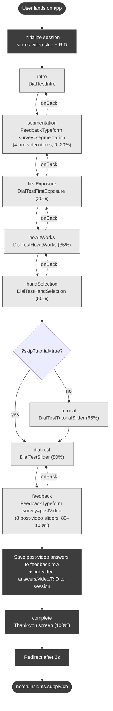

# Screen Flow Map

Map of screens in the Dial Test app. Source of truth: `src/app/App.tsx`.

This round (Amazon VA Combo): 2 videos, each on its own `?video=` slug, fielded
as separate Lucid campaigns. Post-only outcome design — pre-video segmentation
(demographics + two bipolar sliders) AND a post-video block of 8 bipolar
sliders. Each item is asked exactly once (pre- OR post-video, never both); there
is no pre/post pairing and no randomization anywhere. The final save + Lucid
completion redirect fire at the end of the post-video block.

## High-level flow

## Steps and components

| `AppStep`       | Component                | Progress | Notes                                                                 |
| --------------- | ------------------------ | -------- | --------------------------------------------------------------------- |
| `intro`         | `DialTestIntro`          | —        | Static welcome screen                                                 |
| `segmentation`  | `FeedbackTypeform`       | 0–20%    | 4 pre-video items: Age, Gender, 2 bipolar sliders (see below)         |
| `firstExposure` | `DialTestFirstExposure`  | 20%      | First video viewing, no input required                                |
| `howItWorks`    | `DialTestHowItWorks`     | 35%      | Static explainer of the slider mechanic                               |
| `handSelection` | `DialTestHandSelection`  | 50%      | Captures handedness; persisted to `localStorage['sliderSide']`        |
| `tutorial`      | `DialTestTutorialSlider` | 65%      | Slider practice run (skipped with `?skipTutorial=true`)               |
| `dialTest`      | `DialTestSlider`         | 80%      | Recorded slider test; saves dial data, then advances to `feedback`    |
| `feedback`      | `FeedbackTypeform`       | 80–100%  | 8 post-video bipolar sliders (see below); on submit fires final save  |
| `complete`      | inline thank-you screen  | 100%     | Auto-redirects to Lucid after 2s                                      |

## URL parameters

| Param          | Values | Effect                                                                                     |
| -------------- | ------ | ------------------------------------------------------------------------------------------ |
| `video`        | slug   | Selects the clip: `amazon-top-down`, `amazon-bottom-up`. Missing/invalid → `amazon-top-down`. |
| `test`         | `true` | Test mode — nothing is saved to the database                                                |
| `skipTutorial` | `true` | Skip the `tutorial` screen only                                                             |
| `RID`          | any    | Stored on the session and forwarded to the Lucid callback URL on completion                |

The variant is fixed to `slider` and sent to the backend as such for shape compatibility (`VARIANT` constant in `App.tsx`).

## Pre-video questions (`FeedbackTypeform`, `survey="segmentation"`)

Same set for both videos, in this exact order (no randomization). These are
covariates/segments, stored in the segmentation / `preVideoAnswers` blob:

1. `yearOfBirth` (4-digit year) — Age, same input style as prior rounds
2. `gender` (single) — Male, Female, Other
3. `supportDcDevelopment` (bipolar slider) — "Do you support or oppose data center development in your local community?" Strongly Oppose → Neutral → Strongly Support
4. `positiveImpactLargeTech` (bipolar slider) — "…large tech companies have a positive impact on your local community?" Strongly Disagree → Neutral → Strongly Agree

## Post-video questions (`FeedbackTypeform`, `survey="postVideo"`)

8 bipolar sliders, post-only, fixed order (no randomization). Stored in the
`feedback:` row (the post-video answers blob), separate from pre-video answers:

1. `dcBuiltResponsibly` — "…data centers are built responsibly in your community?" Disagree → Neutral → Agree
2. `regulateLargeTech` — "…government should regulate large tech companies more?" Disagree → Neutral → Agree
3. `amazonFavorability` — "…favorable or unfavorable opinion of Amazon." Very Unfavorable → Neutral → Very Favorable
4. `amazonPositiveImpactVirginia` — "…Amazon has a positive impact on Virginia and its communities?" Disagree → Neutral → Agree
5. `amazonGoodEmployer` — "…Amazon is a good employer?" Disagree → Neutral → Agree
6. `amazonDcBuiltResponsibly` — "…Amazon data centers are built responsibly?" Disagree → Neutral → Agree
7. `supportAmazonDcDevelopment` — "…support or oppose Amazon data center development in your local community?" Strongly Oppose → Neutral → Strongly Support
8. `regulateAmazon` — "…government should regulate Amazon data centers more?" Disagree → Neutral → Agree

Analyst note: the two Regulation items are reverse-valence vs. favorability; a
pro-Amazon respondent lands on the "disagree/left" side. Slider direction is kept
as written; reverse-scoring is handled downstream.

## Data storage (this round)

Per session, in the KV store (`kv_store_640b0dec`, edge function `make-server-640b0dec`):

- `session:{id}` — metadata incl. top-level `video` slug and `rid`; `pages.segmentation.answers` and `pages.completion.preVideoAnswers` both hold the pre-video answers (Age, Gender, and the two pre-video sliders) — the breakdown covariates.
- `feedback:{id}` — the 8 post-video slider answers plus video metadata fields (the outcome metrics).
- `dialdata:{id}:actual` — recorded dial data points.
